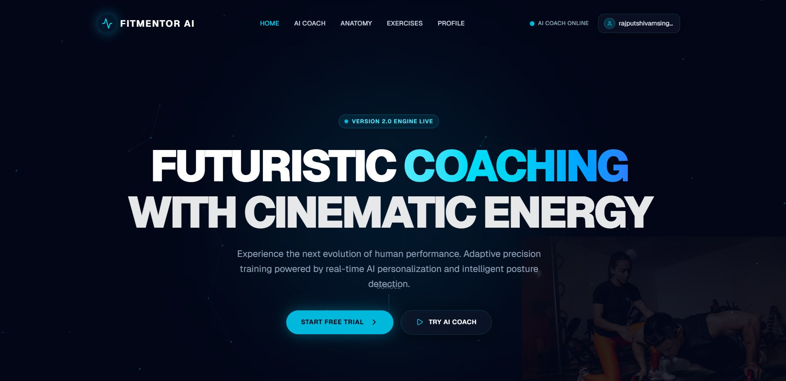
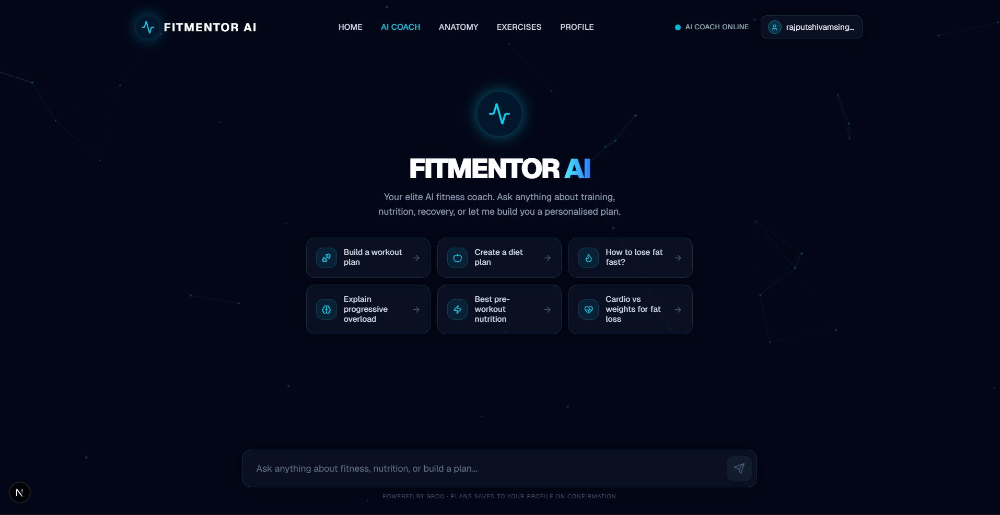
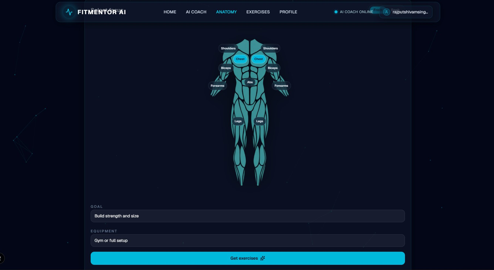
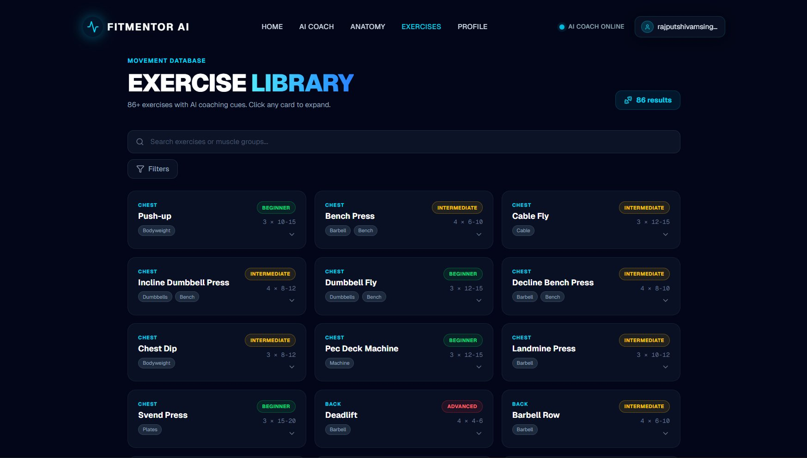
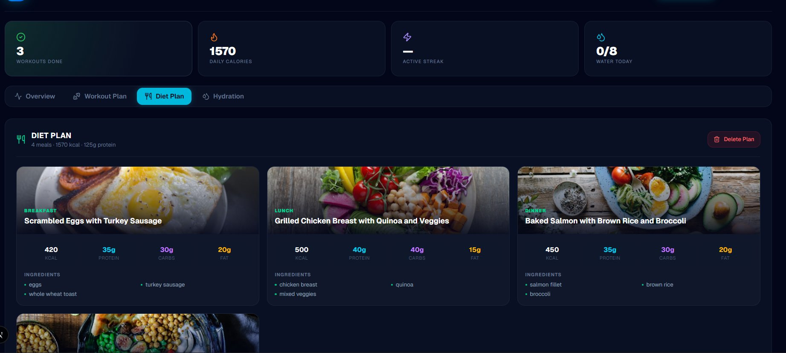

<div align="center">

<br/>


<br/><br/>

# ⚡ FitMentor AI

### Next-generation AI fitness coaching — personalized plans, anatomy mapping & real-time guidance

<br/>

[](https://vercel.com/new/clone?repository-url=https://github.com/rajputshivamsingh510/fitmentor-ai)
&nbsp;&nbsp;
[🐛 Report Bug](https://github.com/rajputshivamsingh510/fitmentor-ai/issues)
&nbsp;&nbsp;
[✨ Request Feature](https://github.com/rajputshivamsingh510/fitmentor-ai/issues)

<br/>

</div>

---

## 📸 Preview

<br/>

### 🏠 Landing Page
> Particle-powered hero with animated background and cinematic design



<br/>

### 🤖 AI Coach
> Real-time streaming chat — ask anything or generate full workout & diet plans instantly



<br/>

### 🫀 Anatomy Viewer
> Interactive muscle map — click any muscle group to get targeted AI-powered exercises



<br/>

### 💪 Exercise Library
> 86+ exercises with difficulty badges, equipment filters and expandable AI coaching cues



<br/>

### 📊 Fitness Dashboard
> Full-width dashboard — diet plans with meal images, macro tracking, workout calendar & hydration



---

## ✨ Features

<table>
<tr>
<td width="50%">

### 🤖 AI-Powered Coach
- Real-time **streaming chat** via Claude Sonnet
- Generates personalized **4-week periodized workout plans**
- Creates custom **meal plans** with full macro breakdowns & food images
- Remembers your fitness goals mid-conversation

</td>
<td width="50%">

### 📊 Fitness Dashboard
- Full-width responsive **profile dashboard**
- **Workout calendar** — mark sessions done, skipped, or missed
- **Hydration tracker** with daily goals & 7-day history
- **Analytics** — streaks, session breakdown donut chart, weekly progress

</td>
</tr>
<tr>
<td width="50%">

### 🫀 Anatomy Viewer
- Interactive **SVG muscle map** (front & back view)
- Click any muscle group → AI generates targeted exercises instantly
- Goal & equipment-aware recommendations

</td>
<td width="50%">

### 💪 Exercise Library
- **86+ exercises** with sets, reps & difficulty levels
- Filter by **muscle group**, **equipment**, **difficulty**
- Expandable cards with AI coaching tips per exercise

</td>
</tr>
<tr>
<td width="50%">

### 🔐 Auth & Data Persistence
- **Supabase Auth** — email/password signup & login
- Plans **saved to database** — persist across sessions & devices
- Row Level Security — users only access their own data

</td>
<td width="50%">

### 📱 Fully Responsive
- **Mobile-first** — works on phones, tablets & desktops
- Touch-friendly workout card scroll with **snap points**
- Scrollable tab navigation optimized for small screens

</td>
</tr>
</table>

---

## 🛠️ Tech Stack

<div align="center">

| Layer | Technology | Purpose |
|---|---|---|
| **Framework** | Next.js 16 (App Router) | Full-stack React framework |
| **Language** | TypeScript 5 | Type safety throughout |
| **Styling** | Tailwind CSS v4 + Framer Motion | Responsive UI + animations |
| **AI** | Anthropic Claude Sonnet | Workout & diet plan generation |
| **Auth & DB** | Supabase | Authentication + PostgreSQL |
| **Payments** | Razorpay | Subscription billing |
| **State** | Zustand | Client-side state management |
| **Particles** | tsParticles | Animated background |
| **Icons** | Lucide React | Icon library |
| **Dates** | date-fns | Calendar & date utilities |

</div>

---

## 🚀 Quick Start

### Prerequisites
- **Node.js** 18+
- **npm** 9+
- A [Supabase](https://supabase.com) account (free)
- An [Anthropic](https://console.anthropic.com) API key

### 1. Clone the repository

```bash
git clone https://github.com/rajputshivamsingh510/fitmentor-ai.git
cd fitmentor-ai
```

### 2. Install dependencies

```bash
npm install
```

### 3. Set up environment variables

Create a `.env.local` file in the root:

```env
# Supabase
NEXT_PUBLIC_SUPABASE_URL=https://xxxx.supabase.co
NEXT_PUBLIC_SUPABASE_ANON_KEY=eyJxxx...

# Anthropic Claude
ANTHROPIC_API_KEY=sk-ant-xxx...

# Razorpay (optional — only needed for payments)
RAZORPAY_KEY_ID=rzp_xxx...
RAZORPAY_KEY_SECRET=xxx...
```

### 4. Set up the database

1. Go to [supabase.com](https://supabase.com) → create a new project
2. Navigate to **SQL Editor**
3. Paste the contents of `supabase-schema.sql` and click **Run**
4. Copy your **Project URL** and **anon key** from **Settings → API** into `.env.local`

### 5. Run the development server

```bash
npm run dev
```

Open [http://localhost:3000](http://localhost:3000) 🎉

---

### 📱 Testing on Mobile (same WiFi)

```bash
# Find your local IP
ipconfig        # Windows
ifconfig        # Mac / Linux

# Start server accessible on your network
npx next dev -H 0.0.0.0 -p 3000
```

Then open `http://YOUR_LOCAL_IP:3000` on your phone.

---

## 🔑 Getting API Keys

<details>
<summary><b>🟢 Supabase (Free)</b></summary>
<br/>

1. Create account at [supabase.com](https://supabase.com)
2. Click **New Project** → wait ~2 min to spin up
3. Go to **Settings → API**
4. Copy **Project URL** → `NEXT_PUBLIC_SUPABASE_URL`
5. Copy **anon public** key → `NEXT_PUBLIC_SUPABASE_ANON_KEY`

</details>

<details>
<summary><b>🟠 Anthropic Claude (Paid — ~$5 to start)</b></summary>
<br/>

1. Create account at [console.anthropic.com](https://console.anthropic.com)
2. Go to **API Keys** → **Create Key**
3. Copy key → `ANTHROPIC_API_KEY`

> The app uses `claude-sonnet-4-5` by default. You can change the model in `src/app/api/chat/route.ts`

</details>

<details>
<summary><b>🔵 Razorpay (Optional)</b></summary>
<br/>

1. Create account at [razorpay.com](https://razorpay.com)
2. Go to **Settings → API Keys** → **Generate Key**
3. Copy **Key ID** → `RAZORPAY_KEY_ID`
4. Copy **Key Secret** → `RAZORPAY_KEY_SECRET`

</details>

---

## 📁 Project Structure

```
fitmentor-ai/
├── src/
│   ├── app/
│   │   ├── page.tsx                    ← Landing page
│   │   ├── layout.tsx                  ← Root layout + viewport meta
│   │   ├── globals.css                 ← Global styles
│   │   ├── coach/page.tsx              ← AI Chat coach
│   │   ├── profile/page.tsx            ← Fitness dashboard
│   │   ├── anatomy/page.tsx            ← Interactive muscle map
│   │   ├── exercises/page.tsx          ← Exercise library
│   │   ├── auth/
│   │   │   ├── login/page.tsx
│   │   │   ├── signup/page.tsx
│   │   │   └── callback/route.ts
│   │   └── api/
│   │       ├── chat/route.ts           ← Claude AI streaming
│   │       ├── anatomy/route.ts        ← Muscle-specific AI
│   │       ├── save-plan/route.ts      ← Save plans to Supabase
│   │       └── payment/               ← Razorpay integration
│   ├── components/
│   │   ├── layout/Navbar.tsx           ← Auth-aware responsive navbar
│   │   ├── home/                       ← Landing page sections
│   │   ├── profile/AnalyticsSection.tsx
│   │   ├── muscle-map/                 ← Anatomy viewer components
│   │   └── animations/ParticleBackground.tsx
│   ├── data/exercises.ts               ← 86+ exercise database
│   ├── hooks/useSubscription.ts
│   ├── lib/supabase/
│   ├── store/userStore.ts              ← Zustand store + Supabase sync
│   └── proxy.ts                        ← Route protection (Next.js 16)
├── public/
│   ├── screenshots/                    ← README screenshots
│   ├── anatomy-figure-front.svg
│   └── anatomy-figure-back.svg
├── supabase-schema.sql                 ← Run this in Supabase SQL Editor
├── next.config.ts
└── .env.local                          ← Your API keys (not committed)
```

---

## 🗄️ Database Schema

```sql
-- Workout Plans
workout_plans (
  id          uuid PRIMARY KEY,
  user_id     uuid REFERENCES auth.users,
  workouts    jsonb,        -- array of daily workout objects
  created_at  timestamp,
  updated_at  timestamp
)

-- Diet Plans
diet_plans (
  id          uuid PRIMARY KEY,
  user_id     uuid REFERENCES auth.users,
  meals       jsonb,        -- array of meal objects with macros
  created_at  timestamp,
  updated_at  timestamp
)
```

> ✅ Row Level Security enabled — users can only read/write their own data.

---

## 🚢 Deployment

### Deploy to Vercel (Recommended)

[](https://vercel.com/new/clone?repository-url=https://github.com/rajputshivamsingh510/fitmentor-ai)

1. Click the button above or import your repo at [vercel.com](https://vercel.com)
2. Add all environment variables from `.env.local` in the Vercel dashboard
3. Hit **Deploy** — Vercel auto-detects Next.js and handles the rest ✅

---

## ❓ Troubleshooting

<details>
<summary><b>AI Coach doesn't respond</b></summary>

- Check `ANTHROPIC_API_KEY` is set in `.env.local`
- Make sure the key has credits at [console.anthropic.com](https://console.anthropic.com)
- Check browser console for API errors

</details>

<details>
<summary><b>Login / Signup not working</b></summary>

- Verify `NEXT_PUBLIC_SUPABASE_URL` has no trailing slash
- Use the **anon** key, not the **service_role** key
- Run `supabase-schema.sql` in the SQL Editor if you haven't already

</details>

<details>
<summary><b>Profile shows no data after generating a plan</b></summary>

- Make sure you're logged in before generating a plan
- Check Supabase → Table Editor → `workout_plans` to see if rows exist
- Run `supabase-migration-fix-constraints.sql` if you get constraint errors

</details>

<details>
<summary><b>Port already in use</b></summary>

```bash
npx kill-port 3000
npm run dev
```

</details>

<details>
<summary><b>Mobile shows blank page</b></summary>

- Run with `npx next dev -H 0.0.0.0 -p 3000`
- Both devices must be on the **same WiFi**
- Check Windows Firewall isn't blocking port 3000

</details>

---

## 📄 License

MIT License — see [LICENSE](LICENSE) for details.

---

<div align="center">

**Built with ❤️ using Next.js, Claude AI & Supabase**

<br/>

⭐ **Star this repo if you found it helpful!**

</div>
